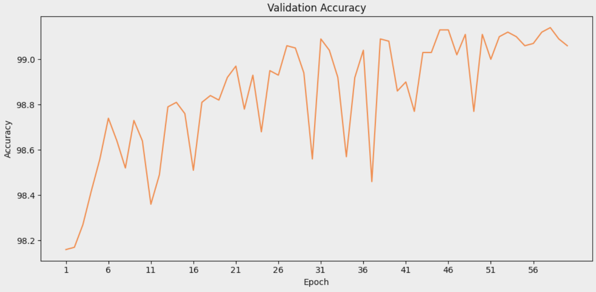
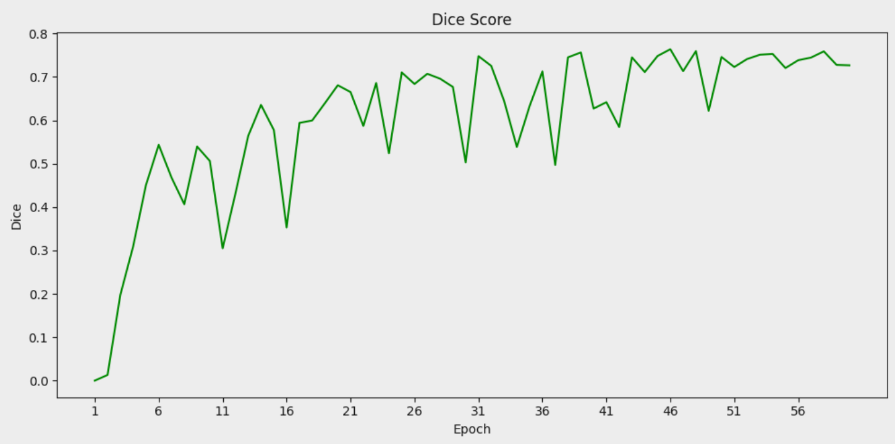
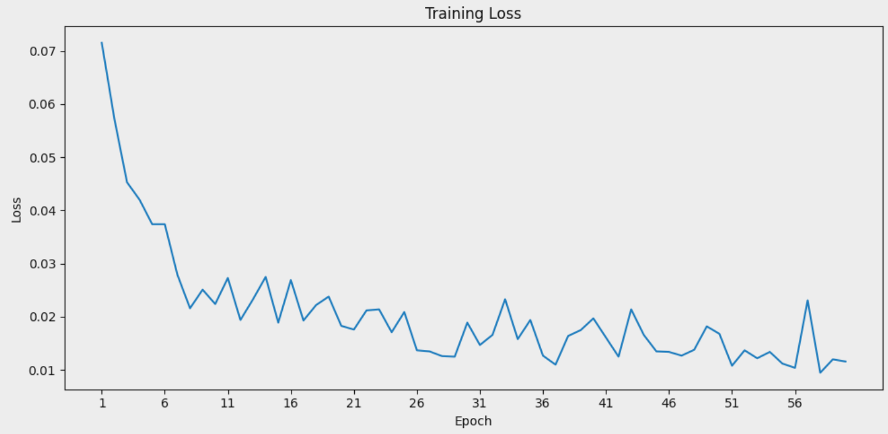
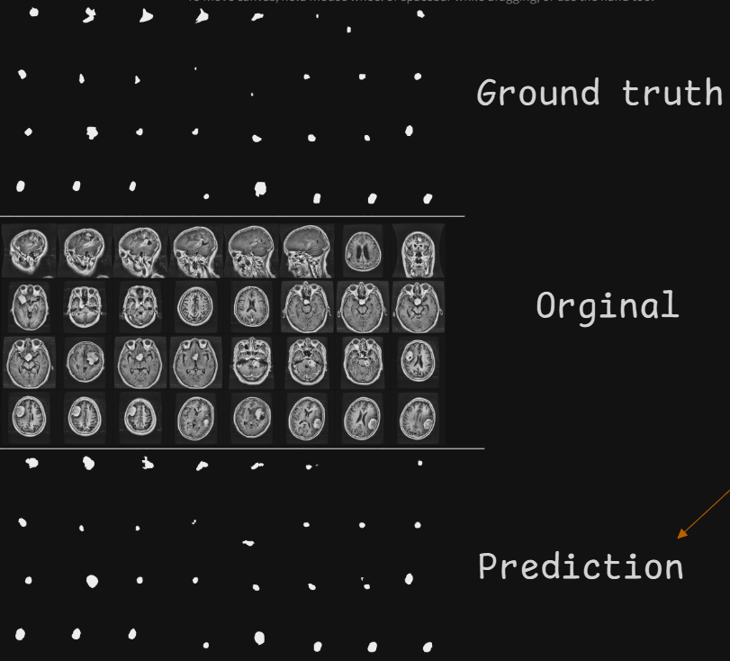
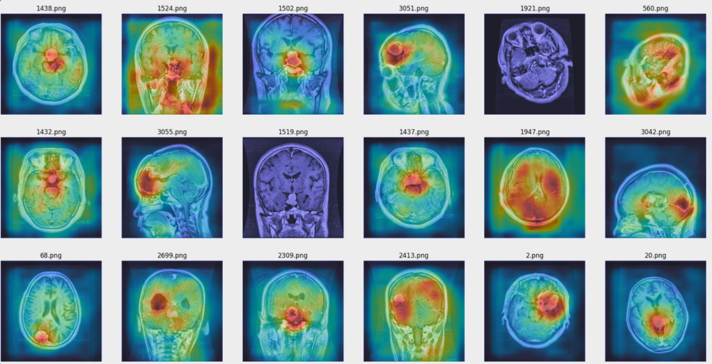

# CSA_SNN Model

This folder contains the implementation of the **Convolutional Spiking Attention SNN (CSA_SNN)** model. The CSA_SNN model integrates spiking neural networks with convolutional layers and attention mechanisms for efficient and accurate medical image segmentation.

## Overview

The CSA_SNN model is designed to leverage the power efficiency of spiking neural networks while incorporating attention mechanisms to focus on salient regions in medical images.

## Results

### Quantitative Results

| Metric            | Value      |
| ----------------- | ---------- |
| Accuracy          | 99.13      |
| Dice Coefficient  | 0.763      |
| Parameters        | 22,610,529 |
| MACs              | 693.08 MMac|
| Power             | 0.0394 kWh |
| CO2 emission      | 0.0187 kg  |
| Training Duration | 3659.15 seconds |

### Qualitative Results

