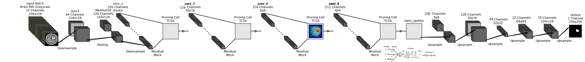
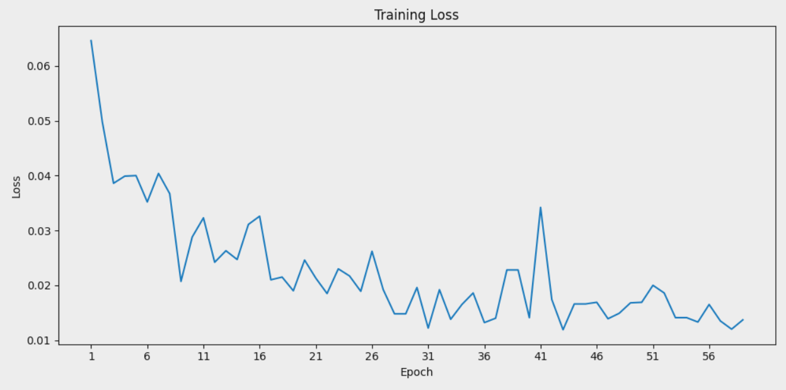
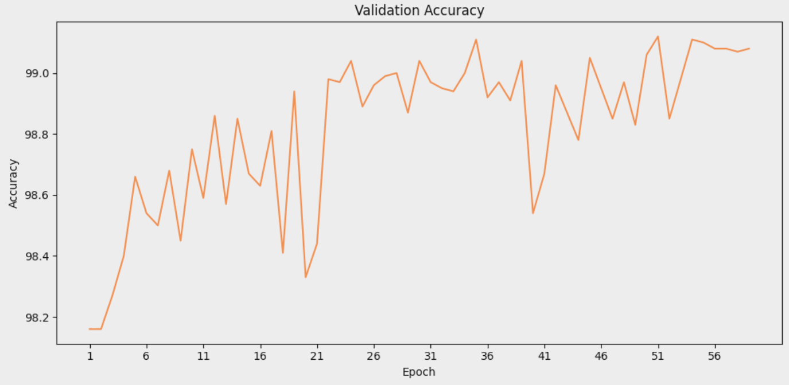
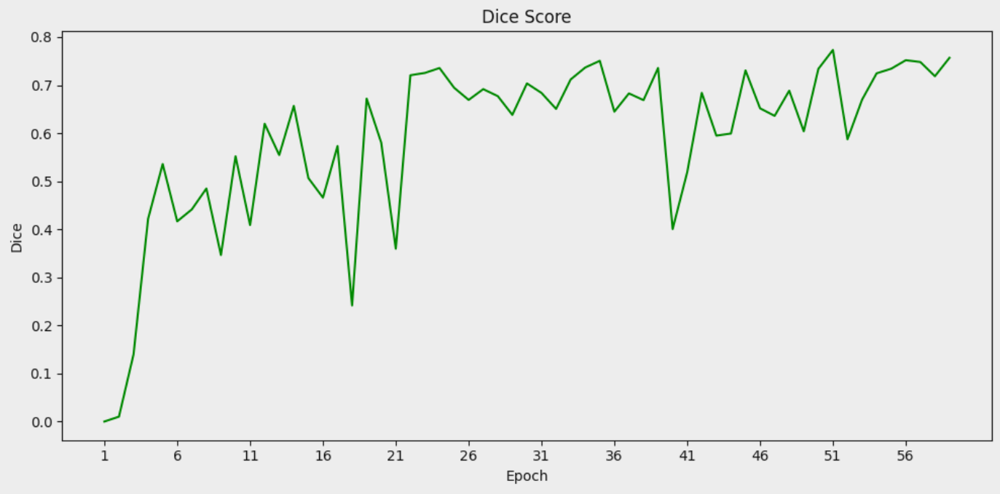
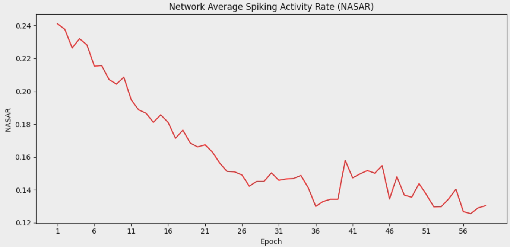
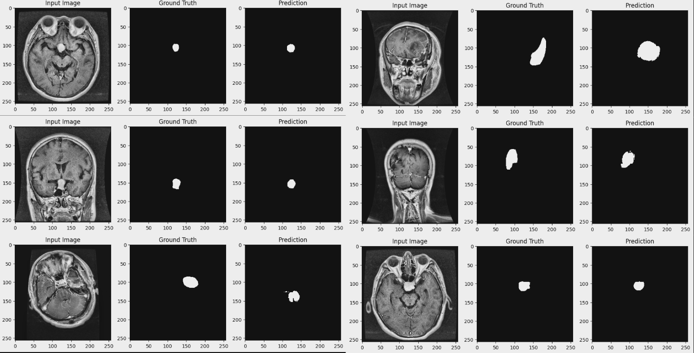
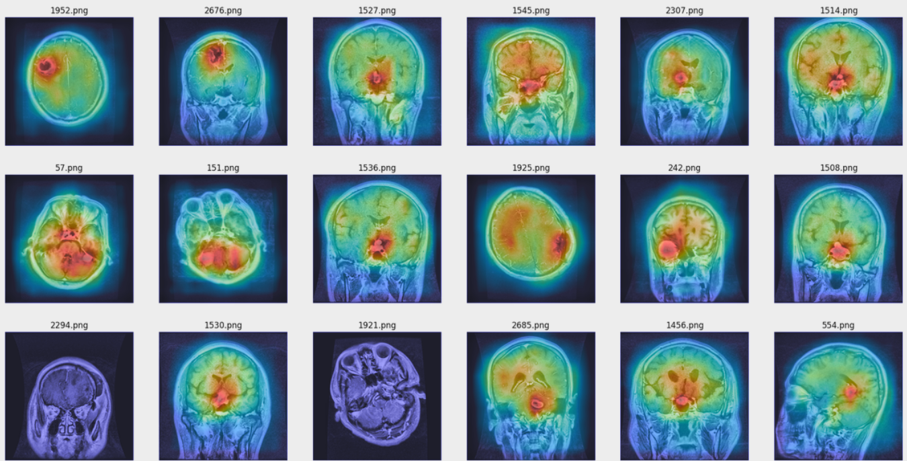
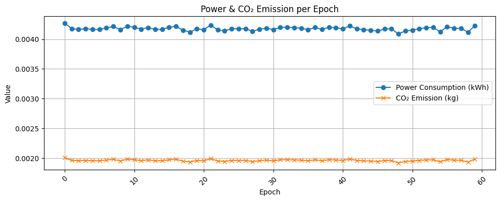

# TCSA_SNN Model

This folder contains the implementation of the **Temporal Convolutional Spiking Attention SNN (TCSA_SNN)** model. The TCSA_SNN model extends spiking neural networks with temporal and spatial attention mechanisms for advanced medical image segmentation.

## Overview

The TCSA_SNN model is optimized for temporal dynamics in spiking neural networks, enabling it to process sequential data effectively while maintaining high segmentation accuracy.

## Results

### Quantitative Results

| Metric            | Value           |
| ----------------- | --------------- |
| Accuracy          | 99.12 %         |
| Dice Coefficient  | 0.773           |
| Parameters        | 22,982,497      |
| MACs              | 763.78 MMac     |
| Power             | 0.2505 kWh      |
| CO2 emission      | 0.1179 kg       |
| Training Duration | 9881.24 seconds |

### Qualitative Results

## Environmental Impact

