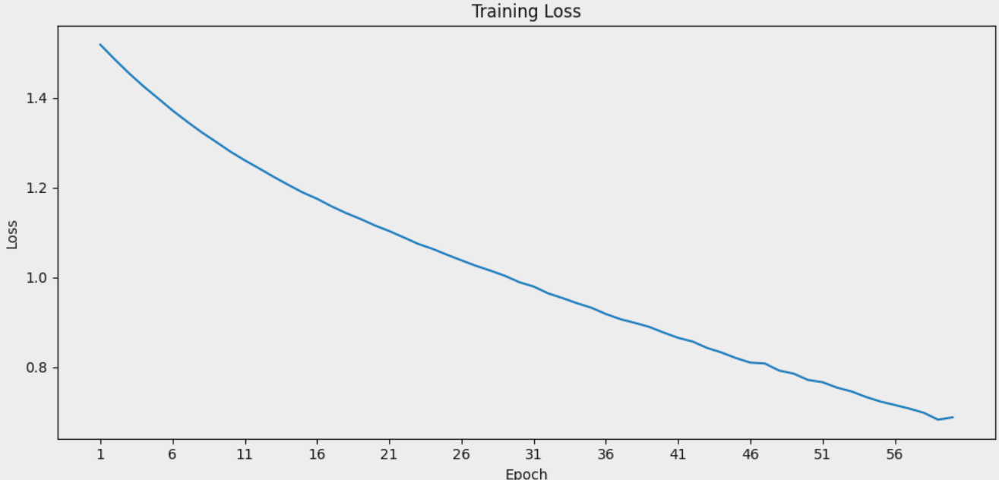
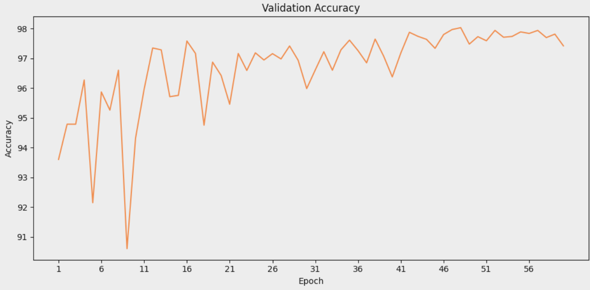
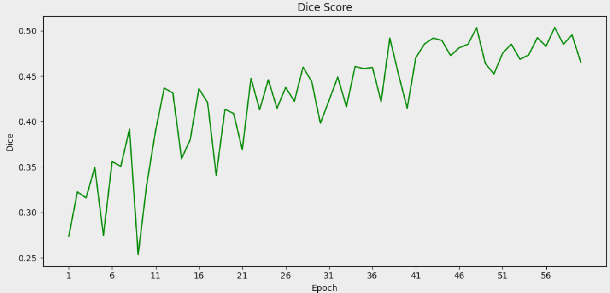
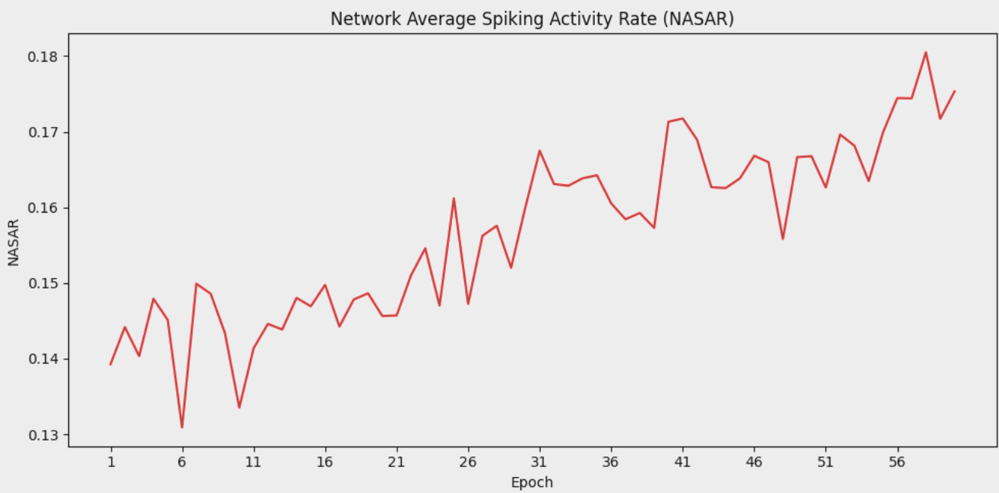
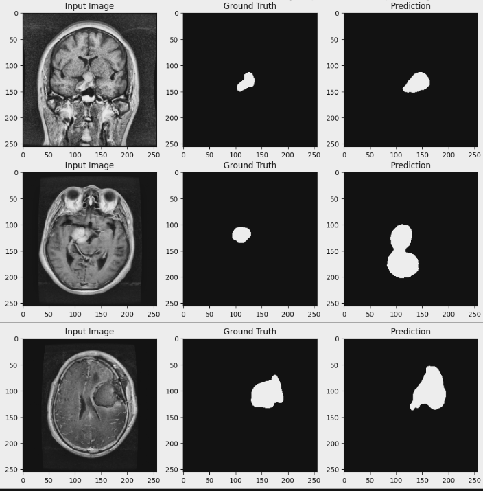
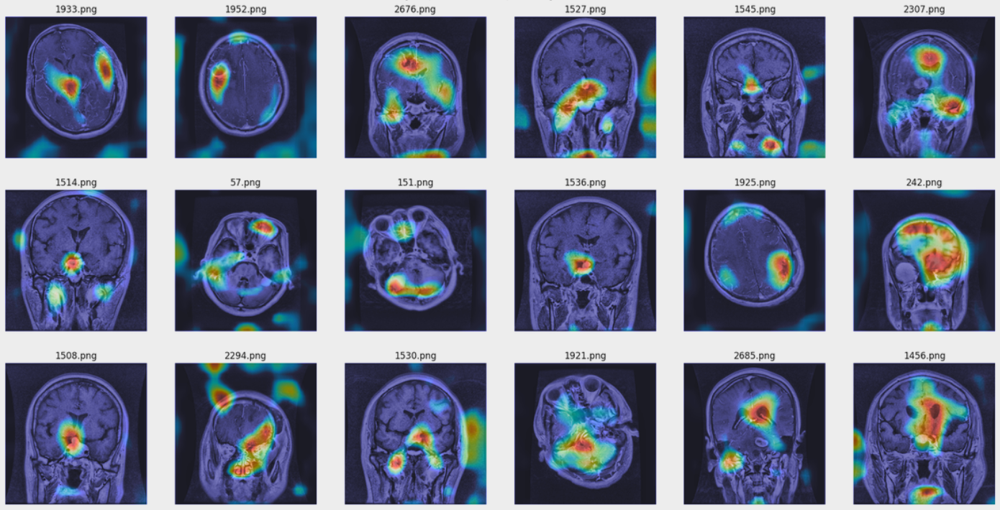
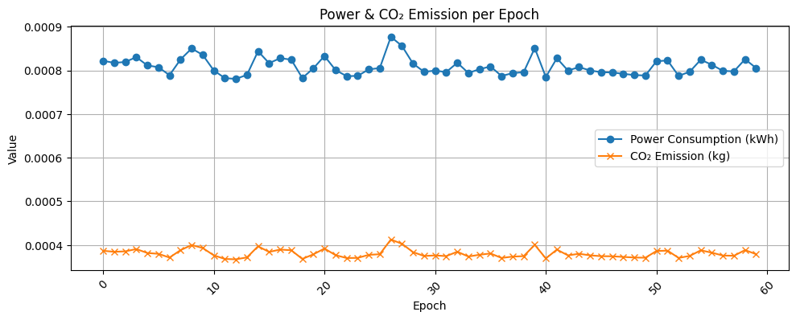

# AttentionSNN Model

This folder contains the implementation of the **Attention Spiking Neural Network (AttentionSNN)** model. The AttentionSNN model combines spiking neural networks with attention mechanisms and Spiking Upsampling to enhance segmentation performance in medical imaging.

## Overview

The AttentionSNN model focuses on improving segmentation accuracy by dynamically attending to important regions in the input images.

## Results

### Quantitative Results

| Metric            | Value           |
| ----------------- | --------------- |
| Accuracy          | 97.94 %         |
| Dice Coefficient  | 0.503           |
| Parameters        | 23,483,986      |
| MACs              | 16.82 MMac      |
| Power             | 0.0485 kWh      |
| CO2 emission      | 0.0228 kg       |
| Training Duration | 1939.52 seconds |

### Qualitative Results

### Qualitative Results

## Environmental Impact

