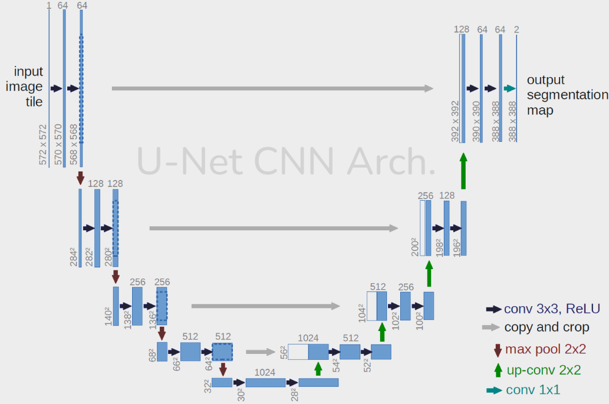
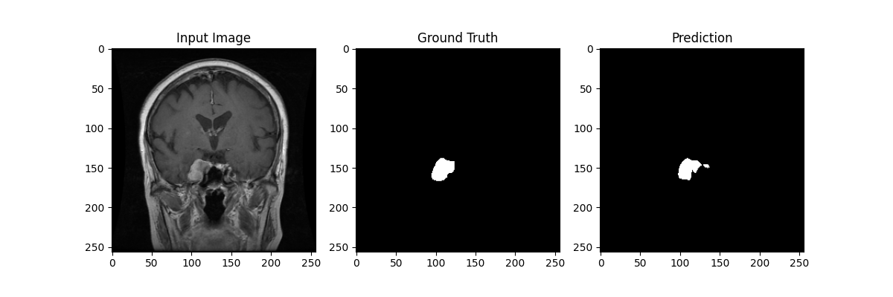
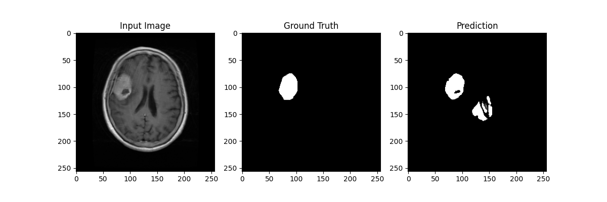
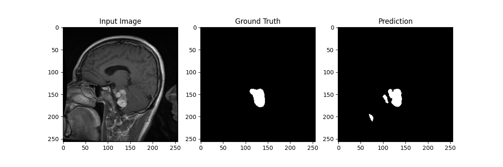

# UNet Architecture for Medical Image Segmentation

This folder contains the implementation of the UNet architecture for medical image segmentation.

## Overview

UNet is a convolutional neural network that was developed for biomedical image segmentation. The network architecture is illustrated below:



## Features

- **Encoder-Decoder Structure**: The network consists of a contracting path (encoder) and an expansive path (decoder) which gives it the u-shaped architecture.
- **Skip Connections**: Skip connections between the encoder and decoder help in retaining spatial information.

## Requirements

- Python 3.x
- PyTorch
- Albumentations
- tqdm

## Usage

### Training

To train the model, open the `train.ipynb` Jupyter Notebook and execute the cells in sequence. Ensure that all dependencies are installed and the dataset paths are correctly configured before running the notebook.


## Results

### Training Parameters

The following training parameters were used:

- **Device**: `cuda` (if available) or `cpu`
- **Learning Rate**: `1e-3`
- **Batch Size**: `32`
- **Number of Epochs**: `5`
- **Number of Workers**: `4`
- **Image Dimensions**: `256x256` (originally `512x512`)
- **Pin Memory**: `True`
- **Load Model**: `False`
- **Checkpoint Name**: `None`

### Dataset Paths

Ensure that your dataset is organized in the following structure and update the paths in your code accordingly:

- **Image Directory**: `./Brain Tumor Segmentation/images`
- **Mask Directory**: `./Brain Tumor Segmentation/masks`
- **Validation Image Directory**: `./Brain Tumor Segmentation/val_images`
- **Validation Mask Directory**: `./Brain Tumor Segmentation/val_masks`

If your dataset is stored on a different drive or path, replace the above paths with your specific drive path. For example:

```plaintext
D:/Your/Custom/Path/images
D:/Your/Custom/Path/masks
D:/Your/Custom/Path/val_images
D:/Your/Custom/Path/val_masks
```

Update the corresponding variables in the code to reflect your drive path.

### Quantitative Results

| Metric            | Value       |
| ----------------- | ----------- |
| Accuracy          | 99.18 %     |
| Dice Coefficient  | 0.779       |
| Parameters        | 31,036,481  |
| MACs              | 54.69 GMac  |
| Power             |  0.1126 kWh  |
| CO2 emission      |  0.0530 kg   |
| Training Duration | 4654.17 seconds |

### Qualitative Results

Below are some sample segmentation results:

#### Plot Samples




## Directory Structure

```
├── Models
│   ├── unet
│   │   ├── model.py
│   │   ├── utils.py
│   │   ├── dataset.py
│   │   ├── train.ipynb
│   │   ├── README.md    
│   │   ├── checkpoints    
│   │   ├── saved_images            
│   │   └── ...
│   └── ...
├── assets
│   ├── unet_arch.png
│   └── ...
└── ...
```

## References

- [Original UNet Paper](https://arxiv.org/abs/1505.04597)
