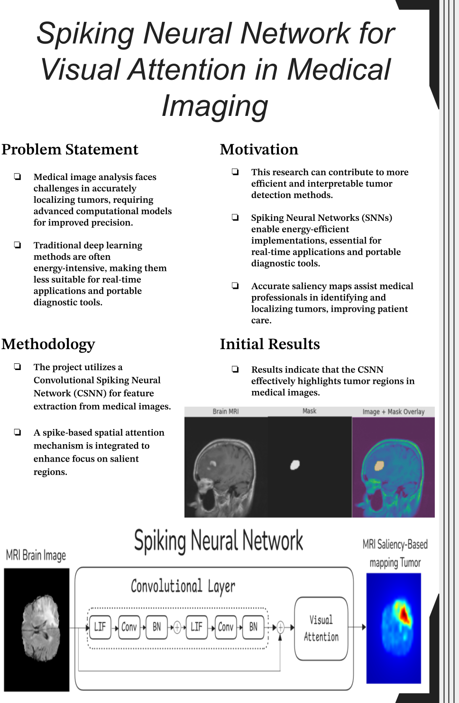

# Spiking Neural Network for Visual Attention in Medical Imaging



## 📌 Overview

Brain tumor detection and saliency-based tumor localization are critical for effective diagnosis and treatment. Traditional deep learning models like CNNs are computationally expensive and require significant power resources. This project explores the use of **Spiking Neural Networks (SNNs)** with a spike-based **visual attention mechanism** to enhance efficiency and accuracy in **medical image analysis**.

## 🏥 Dataset

We utilize the **Brain Tumor Segmentation dataset**, which includes MRI scans with **tumor**. The dataset provides:

- MRI brain images with tumor
- Ground truth segmentation masks

📌 **Dataset Link**: [Kaggle: Brain Tumor Segmentation](https://www.kaggle.com/datasets/nikhilroxtomar/brain-tumor-segmentation)

**Sample MRI Scan with Ground Truth Segmentation:**  


**Sample GIF of Brain with Tumor:**  


## 🏗️ Proposed Model Architecture

The model integrates a **Convolutional Spiking Neural Network (CSNN)** for feature extraction and a **spike-based spatial attention mechanism** to focus on the most salient regions in the image.

### 🔷 Block Diagram of the Proposed Model:


### 🔹 SNN Attention Mechanism:


## 🔬 Methodology

1. **Dataset Preprocessing** - Normalization, augmentation, and conversion of MRI images into a format suitable for SNN processing.
2. **Model Development** - Implementing spike-based attention model.
3. **Training & Evaluation** - Comparing performance with traditional CNNs in terms of accuracy and power efficiency.
4. **Optimization** - Fine-tuning hyperparameters to enhance SNN learning dynamics.

## ⚡ Key Features

✔️ **Bio-Inspired Computing** - Mimics human brain activity for power efficiency.  
✔️ **Saliency-Based Attention** - Focuses on **important tumor regions** dynamically.  
✔️ **Efficient Computation** - Reduces hardware constraints compared to CNNs.  
✔️ **Scalability** - Can be extended for real-time applications.

## 🚀 Installation & Setup

1. Clone this repository:
   ```sh
   git https://github.com/shadynagy111-eng/Spiking-Visual-attention-for-Medical-image-segmentation.git
   cd Spiking-Visual-attention-for-Medical-image-segmentation
   ```
2. Install dependencies:
   ```sh
   pip install -r requirements.txt
   ```
3. Run training notebooks:
   - For U-Net model:
     ```sh
     jupyter notebook models/unet/train.ipynb
     ```
   - For AttentionSNN model:
     ```sh
     jupyter notebook models/attentionSNN/simple_train.ipynb
     ```
   - For CSA-SNN model:
     ```sh
     jupyter notebook models/CSA_SNN/simple_train.ipynb
     ```
   - For TCSA-SNN model:
     ```sh
     jupyter notebook models/TCSA_SNN/Collab_simple_train.ipynb
     ```

## 📊 Results & Comparisons

| Model        | Accuracy | Dice Score | Energy (MACs) | Power (kWh) | CO₂ (kg) | Train Time (s) |
| ------------ | -------- | ---------- | ------------- | ----------- | -------- | -------------- |
| U-Net        | 99.18%   | 0.779      | 54.69 GMac    | 0.1126      | 0.0530   | 4654.17        |
| AttentionSNN | 97.94%   | 0.503      | 16.82 MMac    | 0.0485      | 0.0228   | 1939.52        |
| CSA-SNN      | 99.13%   | 0.763      | 693.08 MMac   | 0.0394      | 0.0187   | 3659.15        |
| TCSA-SNN     | 99.12%   | 0.773      | 763.78 MMac   | 0.2505      | 0.1179   | 9881.24        |

📌 **Key Takeaway:** While U-Net achieves the highest Dice Score (0.779), our SNN-based models show competitive accuracy with significantly lower power consumption in the case of CSA-SNN (0.0394 kWh vs 0.1126 kWh for U-Net). The CSA-SNN model offers the best balance between segmentation performance and energy efficiency, demonstrating the potential of spike-based computing for sustainable medical image analysis.

## 📌 Future Work

🔹 Extending the model for **real-time applications** on edge devices.  
🔹 Exploring **neuromorphic hardware** for further efficiency gains.  
🔹 Improving **spike-based learning rules** for better accuracy.

## 📜 Citation

If you use this work in your research, please cite:

```
@article{spiking2025,
  title={Spiking Neural Network for Visual Attention in Medical Imaging},
  author={Mostafa Ahmed, Mohammed Abdel-Megeed, Shady Ahmed},
  journal={_____},
  year={2025}
}
```

## 📩 Contact

For inquiries or collaborations, reach out via:

- 📧 Email: mostafaahmed96320@gmail.com
- 🔗 LinkedIn: [Mostafa Ahmed](https://www.linkedin.com/in/mostafaahmedgalal/)

---

_This project is part of our research on **spiking neural networks for medical imaging**._ 🎯
